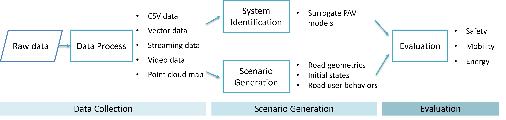
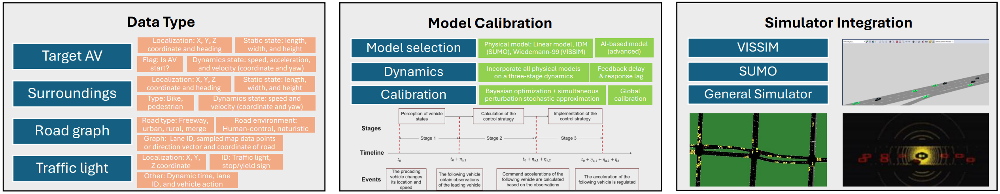

# Open-PAV

Open-PAV (Open Production Automated Vehicle) is an open platform designed to facilitate **data collection, scenario generation, and evaluation** of production automated vehicle (PAV) behaviors. It integrates diverse datasets and calibrated vehicle models, making it an essential tool for researchers and developers aiming to study PAV dynamics and their impacts. The project encourages contributions from the research community and provides ready-to-use model parameters for seamless integration with simulation tools.

## Data Sources and Contributors

### Original Data Sources:

Currently the dataset has examined 13 open-source datasets from 7 providers, each providing distinct insights into AV behavior across various driving conditions and scenarios. They are:

- **Argoverse 2 Motion Forecasting Dataset**. Collected from Austin in Texas, Detroit in Michigan, Miami in Florida, Pittsburgh in Pennsylvania, Palo Alto in California, and Washington, D.C. by Argo AI with researchers from Carnegie Mellon University and the Georgia Institute of Technology. Available at -  [Argoverse 2 Motion Forcasting Dataset](https://www.argoverse.org/av2.html).
- **CATS Open Datasets**. Three datasets were gathered in Tampa, Florida, and Madison, Wisconsin by the CATS Lab. Available at - [CATS Lab](https://github.com/CATS-Lab).
- **Central Ohio ACC Datasets**. Two datasets were collated in Ohio by UCLA Mobility Lab and Transportation Research Center. Available at - [Advanced Driver Assistance System (ADAS)-Equipped Single-Vehicle Data for Central Ohio](https://catalog.data.gov/dataset/advanced-driver-assistance-system-adas-equipped-single-vehicle-data-for-central-ohio).
- **MircoSimACC Dataset**. Collected in four cities in Florida, including Delray Beach, Loxahatchee, Boca Raton, and Parkland by the Florida Atlantic University research group. Available at  - [microSIM-ACC](https://github.com/microSIM-ACC).
- **OpenACC Database**. Four datasets were collected across Italy, Sweden, and Hungary by the European Commission's Joint Research Centre. Available at - [data.europa.eu](https://data.europa.eu/data/datasets/9702c950-c80f-4d2f-982f-44d06ea0009f?locale=en).
- **Vanderbilt ACC Dataset**. Collected in Nashville, Tennessee by Vanderbilt University research group. Available at - [Adaptive Cruise Control Dataset](https://acc-dataset.github.io/).
- **Waymo Open Dataset**. Two datasets were collected in six cities including San Francisco, Mountain View, and Los Angeles in California, Phoenix in Arizona, Detroit in Michigan, and Seattle in Washington by Waymo. Available at - [Waymo Motion Dataset](https://waymo.com/open/data/motion/) and [Vehicle trajectory data processed from the Waymo Open Dataset](https://data.mendeley.com/datasets/wfn2c3437n/2).

### Processed Data Source:

By organizing the data from the above datasets, we processed a unified trajectory dataset ULTra-AV, in which all data are represented using a standardized format. Available at -  [A unified longitudinal trajectory dataset for automated vehicle](https://www.nature.com/articles/s41597-024-03795-y) and [ULTra-AV](https://github.com/CATS-Lab/Filed-Experiment-Data-ULTra-AV).

## Key Features

- **Comprehensive Dataset:**
  - A comprehensive trajectory dataset has been compiled by seven research teams. This dataset encompasses trajectory data from 14 AV brands and 33 AV models, drawn from 13 open-source AV datasets. All data have been converted into a unified vectorized format to enable efficient access and analysis. 
  
- **Kinematic Model Calibration:**
  - Supports linear models, IDM models (for SUMO), Wiedemann-99 (for Vissim), and machine learning-based models.
  - Includes pre-configured model parameters for direct use in traditional simulation software.

- **Simulation Integration:**
  - Enables rapid and accurate simulation of automated vehicle behavior and analysis of their impacts.

- **Community Collaboration:**
  - Designed to foster contributions and collaboration among researchers globally.

## What's New

### March 2025
- **Model Enhancements:** Improved calibration modeling methodology.
- **Simulation Integration:** Configured packages for SUMO, Vissim, and basic parameters for models.

### December 2024
- **Dataset Expansion:** Added new open-source trajectory datasets from ULTRA datasets.
- **Model Enhancements:** Improved basic logic for the project.

## Major Components

Open-PAV consists of the following components:

- **Data Repository:** A unified storage of diverse datasets (LiDAR, images, videos, trajectories).
- **Model Calibration:** Utilities to calibrate vehicle kinematic models and export them for simulation.
- **Simulation Integration:** Pre-configured packages for SUMO, Vissim, and other platforms.

Check the [Open-PAV Documentation](https://markmaaaaa.github.io/OpenPAV) for more details.

## Get Started

### User Guide

- [Overview](https://markmaaaaa.github.io/OpenPAV/)
- [Installation](https://markmaaaaa.github.io/OpenPAV/installation/)
- [Quick Start](https://markmaaaaa.github.io/OpenPAV/quick_start/)
- [Model Calibration](https://markmaaaaa.github.io/OpenPAV/model_calibration/)
- [Simulation Integration](https://markmaaaaa.github.io/OpenPAV/simulation_integration/)
- [Model Download](https://markmaaaaa.github.io/OpenPAV/model_download/)

### Developer Guide

- [API Reference](https://open-pav-documentation.readthedocs.io/en/latest/api.html)
- [Class Design](https://open-pav-documentation.readthedocs.io/en/latest/developer_tutorial.html)
- [Customizing Algorithms](https://open-pav-documentation.readthedocs.io/en/latest/customization.html)

## Relevant Literature

- Zhou, H., Ma, K., Liang, S., Li, X. and Qu, X., 2024. A unified longitudinal trajectory dataset for automated vehicle. *Scientific Data*, *11*(1), p.1123.
- Ma, K., Zhou, H., Liang, Z. and Li, X., 2025. Automated vehicle microscopic energy consumption study (AV-Micro): Data collection and model development. *Energy*, *320*, p.135096.

## Contributors

### Contributing Organizations:
- [CATS Lab](https://catslab.engr.wisc.edu/) (PI: [Xiaopeng Li](https://catslab.engr.wisc.edu/staff/xiaopengli/))

### Technical Contributors:

- UW-Madisons: [Ke Ma](https://markmaaaaa.github.io/KeMa.github.io/), [Hang Zhou]([Zhou, Hang – CATS Lab – UW–Madison](https://catslab.engr.wisc.edu/staff/zhou-hang/)), Keke Long, Chengyuan Ma.

### Contribution Rules:

We welcome contributions to Open-PAV! Here’s how you can help:

- Report bugs and suggest improvements by submitting issues.
- Submit contributions via [pull requests](https://github.com/example/Open-PAV/pulls). Please use the provided [pull request template](.github/PR_TEMPLATE.md).
- Please contact Hang Zhou (hzhou364@wisc.edu) if you want to join the regular contributors' team!

### Acknowledgements:

This project is partially supported by the Center for Connected and Automated Transportation (CCAT) through the project titled *"Traffic Control based on CARMA Platform for Maximal Traffic Mobility and Safety"*, National Institute for Congestion Reduction (NICR) through *"Transit Priority Phase II: Network Control in Realistic Settings with Heterogeneous Vehicles"* and *"Cordon-Metering Rules for Present-Day and Future Cities"*, and National Science Foundation (NSF) through *"NSF	CPS: Small: NSF-DST: Turning “Tragedy of the Commons (ToC)” into “Emergent Cooperative Behavior (ECB)” for Automated Vehicles at Intersections with Meta-Learning"*. We also sincerely appreciate all the dataset providers and contributors for making this work possible.

## License

Open-PAV is released under the [MIT License](LICENSE). See the LICENSE file for details.