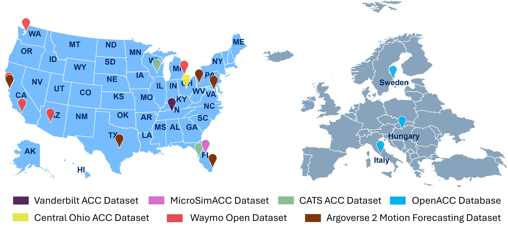

# Open-PAV

Open-PAV (Open Product Automated Vehicle) is an open platform designed to facilitate data collection, model calibration, and simulation of producted automated vehicle behaviors. It integrates diverse datasets and calibrated vehicle models, making it an essential tool for researchers and developers aiming to study product automated vehicle (PAV) dynamics and their impacts. The project encourages contributions from the research community and provides ready-to-use model parameters for seamless integration with simulation tools.

## Key Features

**Comprehensive Data Repository**

- Collects and organizes data from PAVs, including LiDAR, images, videos, and trajectory data (We have summarized 14 AV brands, 33 AV models in 13 Open-source AV Datasets from 6 AV Data Providers, [Dataset Publication](https://www.nature.com/articles/s41597-024-03795-y)).

- Provides datasets in a unified vectorized format for efficient access and analysis.

**AV Model Calibration**

- Supports linear models, IDM models (for SUMO), Wiedemann-99 (for Vissim), and machine learning-based models.
- Includes pre-configured model parameters for direct use in traditional simulation software.

**Multiple Simulator Integrations**

- Enables rapid and accurate simulation of automated vehicle behavior and analysis of their impacts.

**Community Collaboration**

- Designed to foster contributions and collaboration among researchers globally.

## What's New

**March 2025**

- Model Enhancements: Improved calibration modeling methodology.
- Simulation Integration: Configured packages for SUMO, VISSIM, and basic parameters for models.

**December 2024**

- Dataset Expansion: Added new open-source trajectory datasets from ULTRA datasets.
- Model Enhancements: Improved basic logic for the project.

**November 2024**

- Project Startup: Comprehensive installation and user guides are now available.

## Major Components

- **Data Repository**: A unified storage of diverse datasets (LiDAR, images, videos, trajectories).
- **Model Calibration Tools**: Utilities to calibrate vehicle kinematic models and export them for simulation.
- **Simulator Integration**: Pre-configured packages for SUMO, VISSIM, and other platforms.

For more details, refer to the [Open-PAV Documentation](#).
